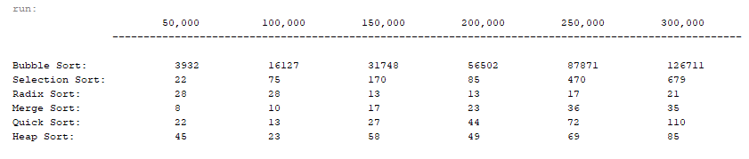

# ExecutionTimeSorting 

This program outputs the execution time of certain sorting methods with various 
    array sizes.

## Example Output

## Analysis Steps

The problem asked for output of six different sorting methods and the execution 
    times for various array sizes.

### Design

I first started by creating the header with the array sizes. I then made a nested
    for loop for each sorting method. The nested for loops were used to increment 
    the array size and create a random array. The random array was passed to the 
    specific sorting method and the execution time was returned. 

### Testing

I first tested by making sure my output looked right. I then tested each sorting 
    method to make sure everything was outputting correctly. 

## Do not change content below this line
## Adapted from a README Built With

* [Dropwizard](http://www.dropwizard.io/1.0.2/docs/) - The web framework used
* [Maven](https://maven.apache.org/) - Dependency Management
* [ROME](https://rometools.github.io/rome/) - Used to generate RSS Feeds

## Contributing

Please read [CONTRIBUTING.md](https://gist.github.com/PurpleBooth/b24679402957c63ec426) for details on our code of conduct, and the process for submitting pull requests to us.

## Versioning

We use [SemVer](http://semver.org/) for versioning. For the versions available, see the [tags on this repository](https://github.com/your/project/tags). 

## Authors

Chase Dickerson

See also the list of [contributors](https://github.com/your/project/contributors) who participated in this project.

## License

This project is licensed under the MIT License - see the [LICENSE.md](LICENSE.md) file for details

## Acknowledgments

Used Y. Daniel Liang's Intro to Java Programming 10th Edition. 
