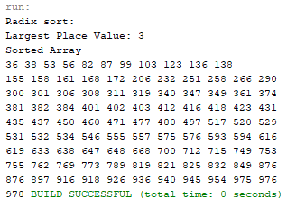

# RadixSort

This program sorts an array using radix sort.

## Example Output

## Analysis Steps

The problem asked for the implementation of the radix sort.

### Design

I first started by creating an array filled with random integers. I then found the
    number of place values for the largest number and passed that and the array to 
    my radix sort method. WIthin my radix sort method, I created an array list with  
    10 indexes and a buckets array set equal to the array list. I then made a for loop
    to loop through and sort the array using the bucket array.

### Testing

I test various array sizes and made sure all of them were sorted correctly. 

## Do not change content below this line
## Adapted from a README Built With

* [Dropwizard](http://www.dropwizard.io/1.0.2/docs/) - The web framework used
* [Maven](https://maven.apache.org/) - Dependency Management
* [ROME](https://rometools.github.io/rome/) - Used to generate RSS Feeds

## Contributing

Please read [CONTRIBUTING.md](https://gist.github.com/PurpleBooth/b24679402957c63ec426) for details on our code of conduct, and the process for submitting pull requests to us.

## Versioning

We use [SemVer](http://semver.org/) for versioning. For the versions available, see the [tags on this repository](https://github.com/your/project/tags). 

## Authors

Chase Dickerson

See also the list of [contributors](https://github.com/your/project/contributors) who participated in this project.

## License

This project is licensed under the MIT License - see the [LICENSE.md](LICENSE.md) file for details

## Acknowledgments

Used Y. Daniel Liang's Intro to Java Programming 10th Edition. 
